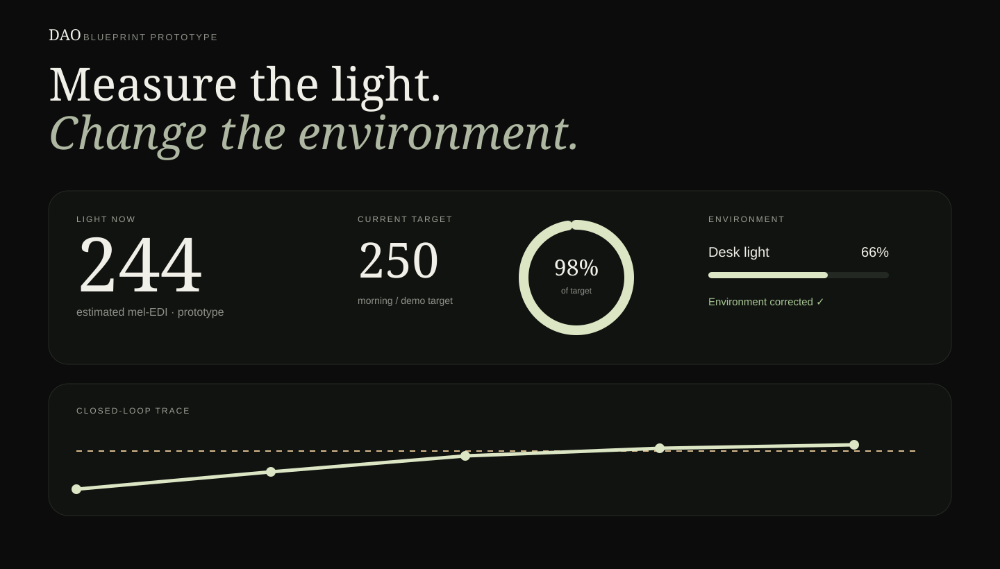
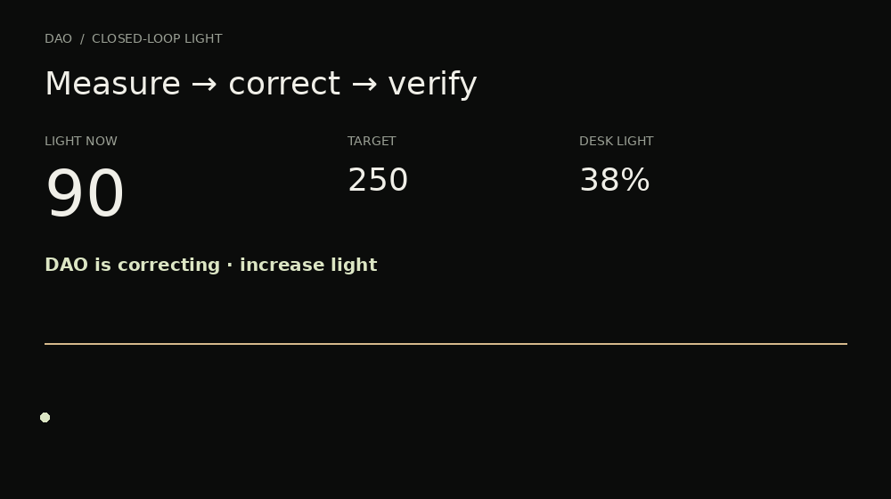
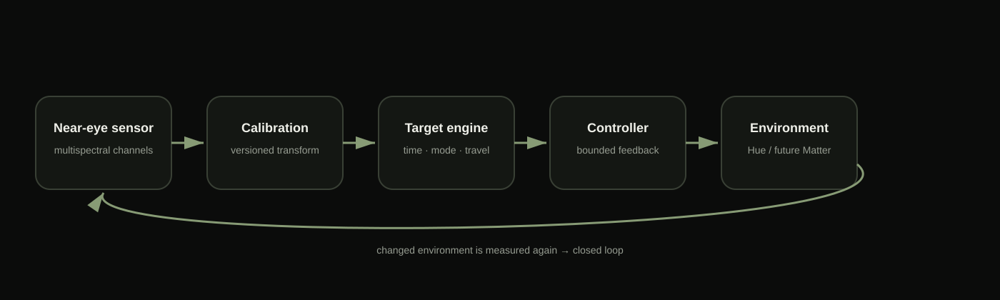
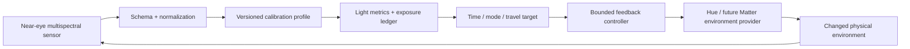
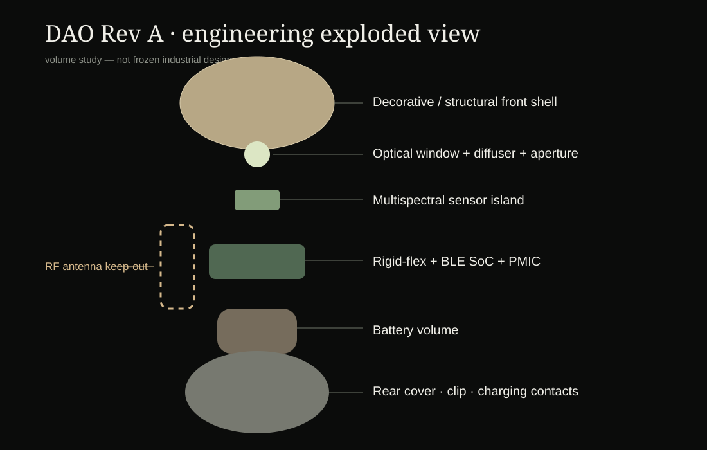

# DAO Light Loop

<p align="center"><strong>An ear-worn closed-loop light system.</strong><br/>Measure the light actually reaching you → compute the right target → change the environment → verify the result.</p>

<p align="center">
  
  
  
  
  
</p>



## The 15-second thesis

Most wearables measure downstream physiology: sleep, heart rate, HRV, temperature. **DAO measures a major environmental input — light — near the eye plane, then closes the loop by changing compatible lighting and measuring again.**

```text
SENSE            UNDERSTAND             ACT                 VERIFY
spectral light → calibrated estimate → time-aware target → environment → measure again
```

The repository is built around one falsifiable proof, not a wellness dashboard:

> **When measured exposure is below the target, DAO changes the environment and the next measurements converge toward the target.**



## What is real today

| Layer | Current state | Evidence in this repo |
|---|---|---|
| Closed-loop controller | **Working** | Deterministic simulator + 19 passing tests |
| Browser demo | **Working** | Zero npm dependencies; `npm start` |
| Time-aware targets | **Working** | Circadian / visual-comfort / focus modes |
| Travel product path | **Working prototype heuristic** | IANA timezone planner + seek/reduce light windows |
| Session telemetry | **Working** | Structured logs + JSON/CSV export |
| Safety/failsafes | **Working** | deadband, saturation, stale-sensor rejection, max duration, max iterations, manual stop |
| Physical sensor ingestion | **Implemented** | ESP32-C3 + AS7341 firmware + validated host schema |
| Philips Hue control | **Implemented** | Local bridge adapter; requires a real bridge to physically verify |
| Optical calibration | **Architecture complete; lab work pending** | versioned calibration layer + validation plan |
| Wearable mechanical layout | **Engineering CAD** | parametric source + STEP/STL exports |
| Miniaturized Rev A electronics | **Specified, not fabricated** | rigid-flex / low-power BLE / power / RF architecture |

**We do not call simulated behavior physically validated.** That distinction is intentional and visible throughout the code and docs.

---

## Run it in under 60 seconds

Requires Node.js 18+.

```bash
npm test
npm start
```

Open **http://localhost:8787** and click **Run Closed Loop Demo**.

No cloud account, database, npm install, Hue bridge or DAO hardware is required for the default demo.

Expected deterministic behavior:

```text
low measured light
      ↓
controller detects deficit
      ↓
lamp command increases
      ↓
new measurement rises
      ↓
controller repeats
      ↓
target reached / deadband hold
```

Generate a machine-readable reference run:

```bash
npm run demo:artifact
```

Outputs:

- `artifacts/demo-run.json`
- `artifacts/demo-run.csv`

---

## Why ear-worn

The core engineering hypothesis is not “earrings are prettier than a wristband.” It is that **an ear-level optical aperture can approximate personal light exposure closer to the vertical eye plane while remaining socially wearable**.

That creates a product architecture with four differentiated properties:

1. **Personal exposure, not room brightness.** Hair, body orientation, windows, shade and travel environments change what reaches the wearer.
2. **Spectral measurement, not only photopic lux.** V0 captures multispectral channels and keeps derived metrics behind a calibration layer.
3. **Closed-loop actuation.** DAO can change lighting rather than only report a score.
4. **Adherence verification.** The same sensor that detects a deficit can verify whether the environment actually changed.

This remains a hypothesis to validate experimentally. The repo includes the exact experiments required to prove or reject it in [`docs/VALIDATION_MATRIX.md`](docs/VALIDATION_MATRIX.md).

---

## System architecture





### Controller invariants

The controller is deliberately simple and inspectable before any ML is added:

- proportional correction;
- configurable deadband;
- brightness saturation;
- max step size;
- minimum physical command interval;
- max iteration count;
- max correction duration;
- stale physical-sensor rejection;
- manual stop;
- structured reason codes and session logs.

For an early hardware company, deterministic control is a feature: it makes failures debuggable and validation measurable.

---

## Product modes already modeled

### 1. Circadian

A time-dependent target layer changes the desired environment across morning, daytime, late-day and evening windows.

### 2. Visual comfort

Moderate ambient/task lighting mode. We intentionally **do not** claim “blue-light damage protection.” Visual discomfort involves glare, luminance contrast, viewing behavior, dry eye and other variables beyond spectral blue content.

### 3. Focus

A configurable bright daytime work-light scene. It is presented as a lighting mode, not a guaranteed cognitive-performance claim.

### 4. Travel

The travel prototype converts an origin/destination timezone displacement into seek-light and reduce-light windows. The next product step is what an app-only travel planner cannot do on its own: **measure whether the user actually received or avoided the intended light and re-plan accordingly.**

The current planner is explicitly labeled a product heuristic, not individualized medical guidance.

---

## Physical V0

```text
AS7341 breakout
      │ I²C
      ▼
ESP32-C3
      │ Wi-Fi telemetry
      ▼
DAO host runtime
      │
      ├── calibration layer
      ├── exposure ledger
      ├── target engine
      └── feedback controller
                 │
                 ▼
          Philips Hue bridge
                 │
                 ▼
           physical light
                 │
                 └──────────→ AS7341 measures again
```

`firmware/` includes versioned telemetry, sequence numbers, reconnect backoff, configurable I²C pins and explicit host validation.

### Production direction

V0 optimizes for speed of proof. Rev A optimizes for wearability:

- AS7343/TCS3448-class miniature multispectral sensor;
- low-power Nordic BLE SoC class device;
- custom rigid-flex PCB;
- 30–80 mAh battery envelope pending measured current budget;
- charger / PMIC;
- optional ultra-low-power IMU for wear/context state;
- controlled diffuser + aperture + optical window;
- RF-transparent antenna region;
- jewelry shell + rear clip + charging contacts.



See [`hardware/REV_A_ARCHITECTURE.md`](hardware/REV_A_ARCHITECTURE.md) and [`cad/`](cad/).

---

## Calibration: no magic numbers hidden behind the UI

The sensor returns **spectral channel counts**, not trustworthy clinical melanopic values.

```text
raw counts
   ↓
dark / gain / integration normalization
   ↓
versioned calibration profile
   ↓
derived photopic + melanopic estimates
   ↓
held-out validation against reference spectra
```

The checked-in development coefficients exist only so the software architecture is executable. Production calibration requires simultaneous reference measurements against a calibrated spectroradiometer across representative daylight and artificial spectra, intensities and incidence angles.

Read [`docs/CALIBRATION.md`](docs/CALIBRATION.md) before interpreting any metric.

---

## Repository map

```text
.
├── core/                  control, calibration, travel, validation, exposure
├── server/                local runtime + API + Hue provider
├── web/                   investor/reviewer demo dashboard
├── firmware/              ESP32-C3 + AS7341 PlatformIO firmware
├── hardware/              BOM, power budget, Rev A architecture, test plan
├── cad/                   parametric engineering CAD + STEP/STL
├── calibration/           reference-data format + fitting workflow
├── tests/                 unit + API integration tests
├── artifacts/             deterministic reference run
├── assets/                dashboard / architecture / engineering visuals
├── docs/                  build plan, validation matrix, claims, API, demo
└── .github/workflows/     software + firmware + CAD-source CI
```

---

## Evidence chain for a funding reviewer

The repo is designed so every ambitious statement has a corresponding engineering artifact or a clearly named experiment:

| Statement | Artifact now | Next proof |
|---|---|---|
| DAO can close a light-control loop | simulator + controller + trace + tests | physical AS7341 → Hue bench loop |
| Ear placement is useful | optical/mechanical architecture | simultaneous ear/eye-plane/reference study |
| Derived spectral metrics can be credible | calibration abstraction | spectroradiometer regression + held-out error |
| Jewelry miniaturization is feasible | component envelopes + CAD | rigid-flex PCB + chosen battery + RF test |
| Travel can become adaptive | timezone planner + exposure ledger | transmeridian field pilot with adherence sensing |
| System can fail safely | explicit failsafes + tests | physical unplug/stale/Hue-error fault injection |

Full matrix: [`docs/VALIDATION_MATRIX.md`](docs/VALIDATION_MATRIX.md).

---

## What we would build during Blueprint

The current repo proves the system architecture. The program sprint is for converting it into a credible **EVT wearable**.

**Phase 1 — Physical loop:** AS7341/next-gen spectral sensor, real Hue, near-ear fixture, reference measurements.  
**Phase 2 — Rev A electronics:** rigid-flex PCB, BLE, power profiling, charging, antenna validation.  
**Phase 3 — Optics + calibration:** diffuser/aperture experiments, angular response, spectroradiometer calibration.  
**Phase 4 — Wearability + pilots:** jewelry enclosure iterations, occlusion/hair/orientation tests, daily + travel pilot protocol.  
**Phase 5 — DFM decision:** lock sensor/optics/battery/mechanics only after measured evidence.

Detailed gates and weekly deliverables: [`docs/BLUEPRINT_BUILD_PLAN.md`](docs/BLUEPRINT_BUILD_PLAN.md).

Proposed capital allocation is documented as planning ranges — **not vendor quotes** — in [`docs/USE_OF_FUNDS.md`](docs/USE_OF_FUNDS.md).

---

## Engineering status

```bash
npm test
# 19 passing tests
```

CI also attempts to compile the ESP32-C3 firmware and syntax-check the parametric CAD source.

Read [`BUILD_STATUS.md`](BUILD_STATUS.md) for the strict boundary between:

- software-verified;
- simulated;
- implemented but awaiting physical hardware;
- not yet built.

---

## Demo script

The funding demo should be physical as soon as the parts arrive, but the narrative stays the same:

1. Show the live near-eye light number.
2. Cover the optical window / move into dim light.
3. DAO identifies a deficit.
4. The room/task light changes automatically.
5. The same sensor measures the changed environment.
6. The trace converges and displays **Environment corrected ✓**.
7. Show the exploded CAD and explain the route from V0 dev boards to Rev A jewelry electronics.

See [`docs/DEMO.md`](docs/DEMO.md).

---

## Claims boundary

DAO is an engineering prototype, **not a medical device**. This repository does not claim to diagnose, prevent, treat or cure disease, nor that the development calibration is medical-grade.

The exact language we will and will not use is documented in [`docs/CLAIMS_AND_SAFETY.md`](docs/CLAIMS_AND_SAFETY.md).

---

## Why this repository exists

A funding application can describe a future product. This repo is meant to make the product **inspectable before it is miniaturized**: code that runs, a controller that can fail, interfaces that can accept real hardware, CAD that exposes mechanical assumptions, and a list of experiments capable of proving us wrong.

That is the standard we want for DAO.
