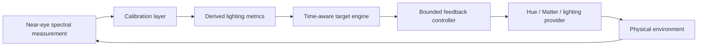

# Architecture

The prototype deliberately keeps the control law transparent. Machine learning is not required to prove the closed-loop thesis.

## Interfaces

- **Sensor**: returns a measurement object. Simulator and physical sources are interchangeable at the controller boundary.
- **Calibration**: transforms normalized spectral-channel counts into development estimates.
- **Target engine**: converts time/mode into a configurable target.
- **Controller**: proportional correction, deadband, saturation and iteration limit.
- **Environment**: simulator or Philips Hue local bridge.

## Safety/claim boundary

This code is an engineering prototype. It does not diagnose, prevent or treat disease. Derived melanopic values are explicitly labeled development estimates until calibrated against a traceable spectroradiometer.
