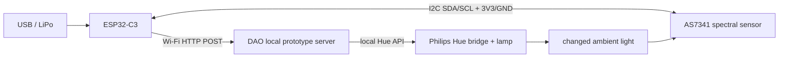

# V0 electrical schematic (logical)

## V0 wiring

The exact GPIO numbers depend on the ESP32-C3 board. Use its default I2C pins or set `Wire.begin(SDA, SCL)` explicitly. Both boards must share ground. Confirm the breakout board voltage requirements before connecting power.

## Rev A partition

- Sensor PCB: optical sensor immediately behind diffuser/aperture.
- Main rigid section: BLE SoC, power management, optional IMU.
- Battery: behind-ear or lower jewelry volume, separated from the optical aperture.
- RF keep-out: no continuous metal enclosure around the antenna region.
